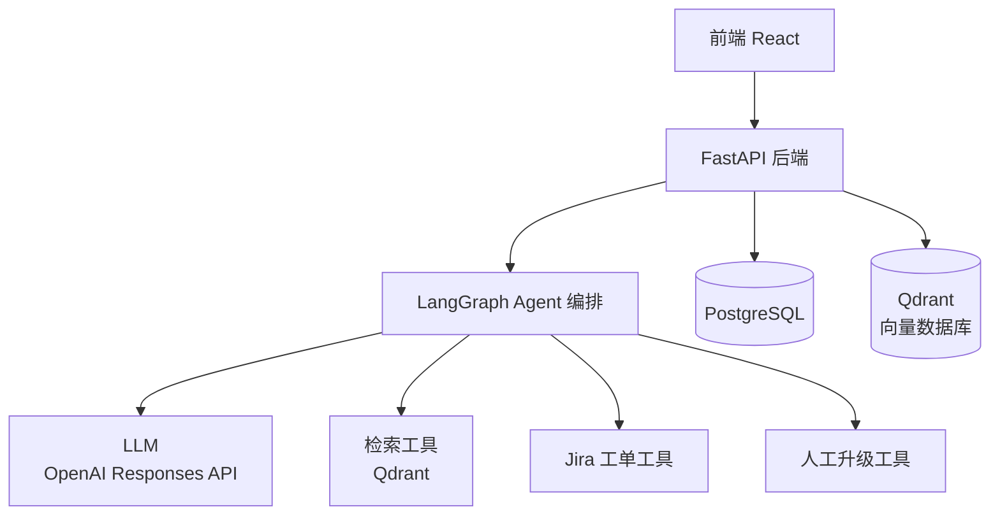

# 企业内部 IT 支持 AI Agent

## 1. 项目概述

本项目实现了一个面向中小企业（SME）的内部 IT 支持 AI Agent。\
该系统能够帮助员工解决常见 IT 问题、检索企业知识文档，并自动生成结构化工单并接入 Jira。

系统核心能力包括：

- 基于 RAG（检索增强生成）的知识问答
- 基于 Agent 的工作流编排（LangGraph）
- 工具调用（Jira API / 检索 / 人工升级）
- 多轮对话与状态管理

***

## 2. 问题背景

在中小企业中，IT/行政团队常面临大量重复请求，例如：

- VPN 无法连接
- 软件安装申请
- 账号权限问题
- 设备故障（电脑 / 打印机）
- 内部流程咨询

这些问题具有以下特点：

- 重复性高
- 可标准化
- 依赖人工处理成本高
- 需要工单系统跟踪

***

## 3. 项目目标

本系统目标：

1. 基于企业知识库提供准确问答
2. 支持多轮对话引导排障
3. 自动收集结构化问题信息
4. 自动生成 Jira 工单
5. 按问题类型分流
6. 复杂问题自动转人工

***

## 4. 系统架构



---

## 5. 核心功能

### 5.1 知识库问答（RAG）

- 从内部文档中检索相关内容
- 输出带引用的回答
- 降低模型幻觉风险

---

### 5.2 意图识别

用户输入自动分类为：

- FAQ（常见问题）
- Incident（故障报修）
- Service Request（服务请求）
- Ticket 查询
- 人工升级

---

### 5.3 多轮信息采集

在报障场景下，Agent 自动收集：

- 设备类型
- 操作系统
- 错误信息
- 发生时间
- 紧急程度
- 联系方式

---

### 5.4 工单生成

系统自动生成结构化工单：

```json
{
  "title": "VPN 无法连接",
  "category": "网络问题",
  "priority": "高",
  "description": "...",
  "device_type": "笔记本电脑",
  "os": "Windows 11",
  "error_message": "...",
  "urgency": "高"
}
```

### 5.5 Jira 集成

系统自动调用 Jira API 创建工单。

**API 接口**

```
POST /rest/api/3/issue
```

**示例请求**

```json
{
  "fields": {
    "project": {
      "key": "IT"
    },
    "summary": "VPN 无法连接",
    "description": "用户无法连接 VPN...",
    "issuetype": {
      "name": "Task"
    }
  }
}
```

### 5.6 人工升级机制

在以下情况触发：

- 检索结果置信度低
- 未找到相关知识
- 涉及安全/权限问题
- 用户多轮反馈未解决

---

## 6. Agent 工作流设计（LangGraph）

**核心节点**

- `router_node`（意图路由）
- `retrieval_node`（知识检索）
- `clarification_node`（信息补全）
- `ticket_builder_node`（工单生成）
- `ticket_submit_node`（提交 Jira）
- `handoff_node`（人工升级）

**工作流程**

1. 用户输入问题
2. 系统进行意图识别
3. 路由：
   - FAQ → 知识检索
   - 报障 → 多轮追问
4. 信息补全
5. 工单生成
6. 用户确认
7. 提交 Jira
8. 必要时转人工

---

## 7. 数据库设计

**users**

- id
- name
- email
- role

**conversations**

- id
- user_id
- status

**messages**

- id
- conversation_id
- role
- content

**documents**

- id
- title
- source_type
- source_url
- access_level

**tickets**

- id
- jira_id
- title
- category
- priority
- status

**agent_runs**

- id
- route
- tools_used
- latency

**feedback**

- id
- conversation_id
- solved
- rating

---

## 8. 技术栈

**后端**

- Python
- FastAPI
- Agent
- LangGraph
- 大模型（OpenAI Responses API）

**数据库**

- PostgreSQL
- 向量数据库（Qdrant）

**前端**

- React / Next.js

**部署**

- Docker

---

## 9. 评估指标

**检索效果**

- Top-K 命中率
- 引用准确率

**Agent 能力**

- 意图识别准确率
- 工单完整率
- 转人工准确率

**系统性能**

- 响应时间
- 首次解决率（FCR）

---

## 10. 技术亮点

- 基于 LangGraph 的有状态 Agent 工作流
- RAG + 引用溯源机制
- Jira 工单系统集成
- 多轮对话信息补全（slot filling）
- 工具调用式 Agent 架构
- 可评估、可优化的 AI 系统设计

---

## 11. 后续优化方向

- 权限控制（不同角色访问不同知识）
- 混合检索（向量 + 关键词）
- 自动优先级预测
- 接入 Slack / 企业微信
- 用户反馈驱动优化

---

## 12. Demo 场景

**用户输入：**

> "我的 VPN 连不上"

**系统流程：**

1. 检索 VPN 故障文档
2. 返回排查步骤（带引用）
3. 继续询问设备信息
4. 收集错误信息
5. 生成工单
6. 提交 Jira

---

## 13. 总结

本项目实现了一个具备实际业务价值的 AI Agent 系统，融合：

- 大模型推理能力
- 知识检索能力
- 工作流编排
- 外部系统集成（Jira）

> 相比简单聊天机器人，该系统更接近企业级 AI 应用落地形态。